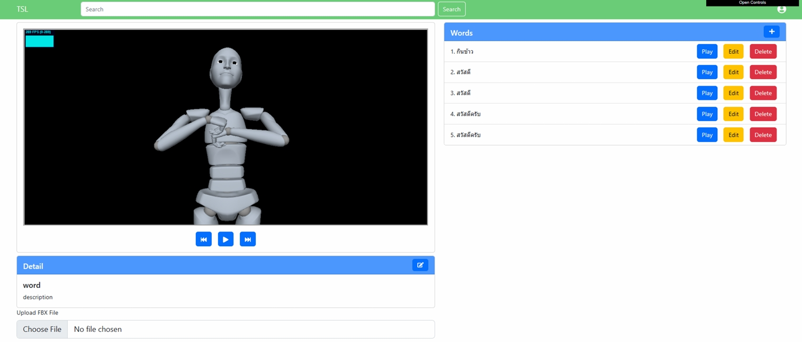
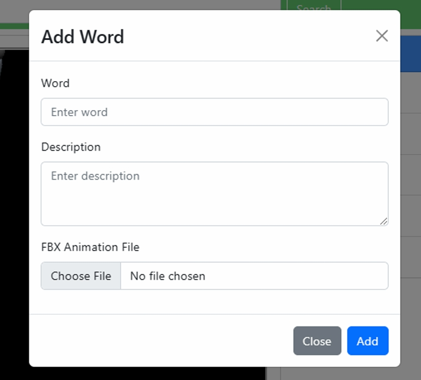
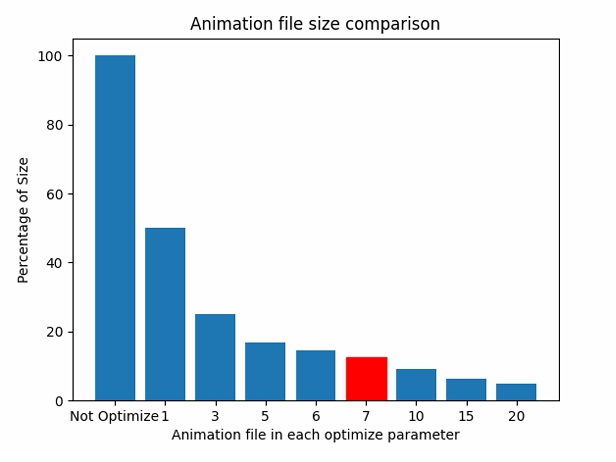
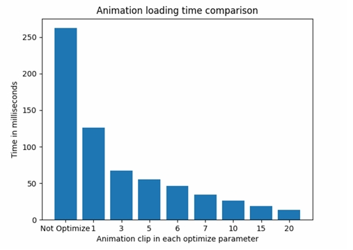
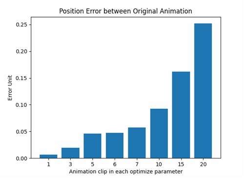
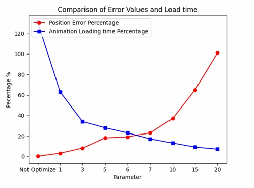

# Web Platform for Managing and Displaying Motion Capture Animation Data Files

## Overview

This platform addresses the limited accessibility of online media for approximately 300,000 deaf and hard-of-hearing individuals in Thailand. Existing online media often features difficult-to-read subtitles and lacks Thai Sign Language interpretation. This challenge is further compounded by the scarcity of qualified Thai Sign Language experts and the high costs associated with hiring them. Additionally, the current process for producing Thai Sign Language animations by computer engineering students at KMUTT, utilizing Blender from expert videos, is time-consuming and heavily relies on manual verification by experts, creating a significant bottleneck.

To overcome these issues, this project introduces a web application for managing Thai Sign Language animation data. The animation data is collected using a Motion Capture Suit and stored in JSON format. By applying a Systematic Sampling technique, the animation file size is reduced by 87.5%, resulting in an 87% faster download time. The platform also enables sign language experts to self-verify data accuracy and allows animations to be exported in both JSON and GLB formats for broader software compatibility. Ultimately, this web application significantly reduces animation production time and enhances the flexibility of data export for various applications.

---

## Key Features

This web platform provides comprehensive functionalities for managing and displaying Thai Sign Language animation data, accommodating different user roles including **System Administrators** and **Sign Language Experts**.

* **Data Management & Optimization:**
    * **Motion Capture Data Ingestion:** Ability to store motion capture data from a motion capture suit into the database.
    * **File Size Reduction:** Capable of reducing the file size of data obtained from the motion capture suit.
    * **Animation Upload:** System administrators can upload animation files.
    * **Animation Export:** Supports exporting animations in both GLB and JSON file formats.

* **Display & Playback:**
    * **Web-based Animation Display:** Ability to display animation results from motion capture data on the web.

* **Lexicon & Content Management:**
    * **Lexicon Creation:** System administrators can create new vocabulary (lexicons) even if animation data is not yet available.
    * **Content Editing:** Sign language experts and system administrators can edit vocabulary details.
    * **Content Deletion:** System administrators can delete unwanted vocabulary and animations from the web.
    * **Animation Search:** Users can search for animations.

* **User Management & Verification:**
    * **Expert Registration:** Ability to register new sign language experts.
    * **Expert Verification:** Sign language experts can verify and categorize the accuracy of animation results.

---

## Technologies Used

This project leverages a modern and robust technology stack:

* **Frontend:**
    * **React:** A JavaScript library for building user interfaces.
    * **Three.js:** A JavaScript 3D library used for displaying 3D animations directly in the browser.

* **Backend:**
    * **Mongoose:** An object data modeling (ODM) library for MongoDB, used for database interactions.
    * **Express.js:** A fast, unopinionated, minimalist web framework for Node.js.
    * **Google Cloud Storage (GCS):** For scalable and secure object storage, likely used for storing animation files.

* **Motion Capture & Animation Creation Software:**
    * **Rokoko Studio:** Software used in conjunction with a motion capture suit for collecting and creating motion capture data.

---

## My Role & Responsibilities

In this 2-person team project, my primary responsibilities focused on:

* **Backend Development:**
    * Designing and implementing **RESTful APIs** using **Express.js**.
    * Database integration and management with **Mongoose**.
    * **Strategic Data Storage Solutions:** Addressing the challenge of storing large animation files (e.g., .fbx) which were not natively efficient for MongoDB. I implemented a solution to store animation metadata (e.g., name, type) in MongoDB via Mongoose, while offloading the large animation files themselves to **Google Cloud Storage (GCS)**. This approach significantly improved retrieval performance, as directly storing and converting large animation files to JSON within MongoDB proved time-consuming for web display.
    * **Authentication System Development:** Implemented a secure user authentication system using **JSON Web Tokens (JWT)** to manage user access and authorization effectively.

* **Theoretical Research & Development Support:**
    * Conducting research on various theoretical concepts and methodologies related to the project.
    * Providing insights and theoretical groundwork for my teammate to conduct experiments and implement solutions.

* **UI Design (Supporting Role):**
    * Contributing to the **UI design using Figma**, with a primary focus on functionality rather than aesthetic refinement.

---

## Screenshots

Below are screenshots illustrating key functionalities of the web platform:

    
     
    <em>Figure 1: The homepage displaying 3D sign language animation playback on the left, a list of associated vocabulary with control options (Play, Edit, Delete) on the right, and animation details at the bottom-left.</em>

 

    
     
    <em>Figure 2: The "Add Word" modal, allowing system administrators to add new vocabulary with a corresponding description and upload an FBX animation file.</em>

---

## Performance & Optimization Results

A core aspect of this project involved optimizing motion capture animation data for efficient web display. Through systematic testing and the application of a **Systematic Sampling** technique, significant improvements were achieved in file size reduction and loading time.

The following results highlight the impact of the optimization process:

    
     
    <em>Figure 3: This bar chart compares the percentage reduction in animation file size across various optimization parameters. It clearly shows that as the optimization parameter increases, the file size decreases significantly.</em>

 

    
     
    <em>Figure 4: This bar chart illustrates the animation loading time in milliseconds, comparing non-optimized animations with those processed under different optimization parameters. Higher optimization parameters lead to substantially faster loading times.</em>

 

    
     
    <em>Figure 5: This bar chart displays the average positional error (in Error Units) between the original animation clips and their optimized versions across different optimization parameters. As expected, higher optimization parameters (more reduction) generally result in a larger error.</em>

 

    
     
    <em>Figure 6: This line graph visually compares the percentage of position error (red line) and animation loading time (blue line) against various optimization parameters. It highlights the trade-off: as loading time decreases, positional error tends to increase, allowing for the identification of an optimal balance.</em>

 

**Key Findings from Optimization:**

Based on comprehensive analysis, **Optimization Parameter 7** was identified as the most suitable, offering an excellent balance between performance gains and acceptable animation accuracy. At this parameter:

* The animation file size was reduced by **87.5%**.
* Animation loading time was reduced by **87%**, significantly improving user experience.
* The average positional error of the animation remained within acceptable thresholds.

---

## Challenges & Lessons Learned

Developing this platform presented several interesting technical challenges, primarily centered around the efficient handling of large-scale motion capture animation data:

* **Efficient Large File Storage and Retrieval:**
    * **Challenge:** Initially, storing raw FBX animation files directly within the MongoDB database (via Mongoose) proved inefficient. Retrieving this data, which was stored as a large Array Buffer, resulted in significant loading times on both the server and client sides, even for relatively small files (e.g., 1 MB). This approach severely impacted the web application's performance.
    * **Solution & Lesson Learned:** To overcome this, I re-architected the data storage strategy. Instead of embedding raw animation files, FBX files are now converted to JSON format and then GZIP-compressed on the client side before being uploaded directly to **Google Cloud Storage (GCS)**. The MongoDB database now only stores metadata about the animations (such as name and type) along with a **URL path referencing the file in GCS**. This distributed storage approach dramatically improved data retrieval efficiency and overall system performance, highlighting the importance of choosing the right storage solution for different data types.

---

## Setup

Please note that this project is currently **not operational**. The core functionality relies on large animation files stored on **Google Cloud Storage (GCS)**, and the associated cloud services/subscriptions have since expired or been terminated.

Therefore, the application cannot be set up and run directly. However, you can still gain a comprehensive understanding of the project's purpose, features, underlying technologies, and my contributions by reviewing the:

* **Overview**
* **Key Features**
* **Technologies Used**
* **My Role & Responsibilities**
* **Screenshots** (which visually demonstrate key functionalities)
* **Performance & Optimization Results**
* **Challenges & Lessons Learned**

---
